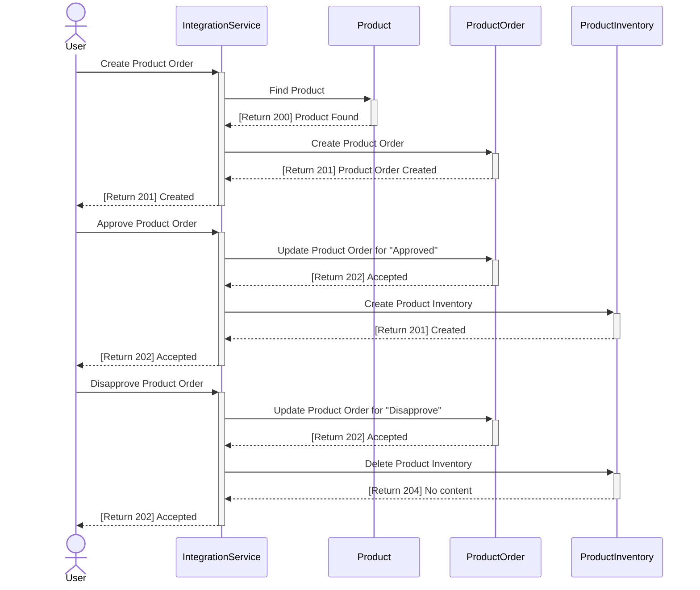

# spring-product-integration-service
spring-product-integration-service

### Sequence Diagram

```mermaid

sequenceDiagram
    actor User
    participant IntegrationService
    participant Product
    participant ProductOrder
    participant ProductInventory
    User->>+IntegrationService: Create Product Order
    IntegrationService->>+Product: Find Product
    Product-->>-IntegrationService: [Return 200] Product Found
    IntegrationService->>+ProductOrder: Create Product Order
    ProductOrder-->>-IntegrationService: [Return 201] Product Order Created
    IntegrationService-->>-User: [Return 201] Created
    
    User->>+IntegrationService: Approve Product Order
    IntegrationService->>+ProductOrder: Update Product Order for "Approved"
    ProductOrder-->>-IntegrationService: [Return 202] Accepted
    IntegrationService->>+ProductInventory: Create Product Inventory
    ProductInventory-->>-IntegrationService: [Return 201] Created
    IntegrationService-->>-User: [Return 202] Accepted

    User->>+IntegrationService: Disapprove Product Order
    IntegrationService->>+ProductOrder: Update Product Order for "Disapprove"
    ProductOrder-->>-IntegrationService: [Return 202] Accepted
    IntegrationService->>+ProductInventory: Delete Product Inventory
    ProductInventory-->>-IntegrationService: [Return 204] No content
    IntegrationService-->>-User: [Return 202] Accepted
```